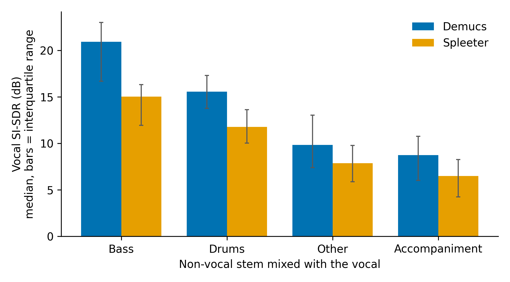
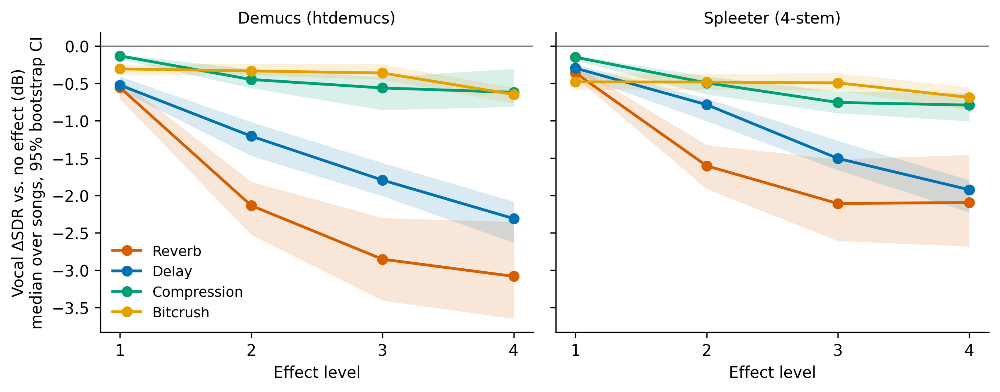

# Stressing source separation

How do common audio conditions affect music source separation? Two experiments on the 50 MUSDB18 test songs, with two pretrained models (Spleeter and Demucs):

1. **Experiment 1: instrumental interference.** How much does each kind of non-vocal stem (drums, bass, other, accompaniment) interfere with extracting the vocal?
2. **Experiment 2: vocal effects.** How do reverb, delay, compression and bitcrushing applied to the vocal change separation quality? The processed vocal's loudness is matched to the original, so the results measure the effect and not a level change.

## Headline result (Experiment 1)

How well is the vocal recovered when it is mixed with just one other stem? Median vocal SI-SDR over the 50 songs, in dB, on mono downmixes, scored against the true vocal stem:

| Vocal mixed with | Vocal SI-SDR (dB), Demucs / Spleeter |
|---|---|
| Bass | 20.94 / 15.04 |
| Drums | 15.57 / 11.78 |
| Other | 9.84 / 7.86 |
| Accompaniment (drums + bass + other) | 8.75 / 6.50 |

Demucs beats Spleeter on every pairing. Both models recover the vocal best when it is mixed with bass or drums, and worst with the `other` stem or the full accompaniment. (Why the harder pairings are harder is a hypothesis we have not tested.) The full table with the other metrics, the non-vocal scores, and the per-song data are in [`experiments/exp1_interference/`](experiments/exp1_interference/) and `results/exp1/`.



## Headline result (Experiment 2)

Median change in vocal SDR (dB) relative to no effect, 50 songs, Demucs / Spleeter (95% confidence intervals are in `results/exp2/tables/`):

| Effect | Level 1 | Level 2 | Level 3 | Level 4 |
|---|---|---|---|---|
| Reverb | -0.55 / -0.36 | -2.13 / -1.60 | -2.85 / -2.11 | -3.08 / -2.09 |
| Delay | -0.52 / -0.29 | -1.20 / -0.78 | -1.79 / -1.50 | -2.31 / -1.92 |
| Compression | -0.13 / -0.15 | -0.45 / -0.49 | -0.56 / -0.75 | -0.62 / -0.79 |
| Bitcrush | -0.30 / -0.48 | -0.33 / -0.48 | -0.36 / -0.49 | -0.65 / -0.69 |

Baseline vocal SDR with no effect: Demucs 8.7 dB, Spleeter 6.8 dB. Reverb and delay degrade the vocal estimate in a graded way; compression and bitcrushing cost under about 0.8 dB. The other stems barely change. Both models keep the effect in the vocal stem instead of removing it (they score much worse against the dry vocal). Full methods and results: [`docs/EXPERIMENT2_HANDOFF.md`](docs/EXPERIMENT2_HANDOFF.md).



## Repository layout

```
src/            ALL the runnable code, named <verb>_<thing>_exp<N> (paths all come from src/config.py)
  config.py                  paths, overridable with environment variables
  effects.py                 the four effects and their level tables (used by Experiment 2)
  Experiment 1 scripts:      make_pairs_exp1.py, run_spleeter_exp1.py, run_demucs_exp1.sh, evaluate_exp1.py
  Experiment 2 scripts:      make_data_exp2.py, run_demucs_exp2.py, run_spleeter_exp2.py,
                             evaluate_exp2.py, make_figures_exp2.py
notebooks/      thin front ends that call the scripts: exp1_interference and exp2_vocal_effects
experiments/    exp1_interference/ and exp2_vocal_effects/: the description of each experiment
                (question, design, results, how to run) plus archived legacy scripts
results/exp1/   per-song metrics, median summary, figure
results/exp2/   metrics.csv, dryref_vocals.csv, loudness_log.csv, figures/, tables/
requirements/   one file per environment (three are needed, see below)
docs/           methods and results write-up for the paper
assets/         see assets/README.md (the reverb impulse response is not included yet)
```

## Quick start

Audio is not stored in the repository (it is hundreds of GB); the scripts regenerate it.

1. **Get MUSDB18** (the 150-track version with `.stem.mp4` files, from the [official page](https://sigsep.github.io/datasets/musdb.html); check its license) and set `MUSDB18_ROOT` to it, or put it in `data/musdb18`. Set `SSS_DATA_ROOT` to a disk with about 400 GB free.
2. **Create the three environments** described in `requirements/`. Spleeter needs Python 3.8; the others are more flexible.
3. **Add the impulse response** described in `assets/README.md`.
4. **Run.** Experiment 1 runs from `notebooks/exp1_interference.ipynb`. Experiment 2 runs from `notebooks/exp2_vocal_effects.ipynb`, or in a terminal:

```
python src/make_data_exp2.py --workers 8      # data-and-evaluation env
python src/run_demucs_exp2.py                             # demucs env
python src/run_spleeter_exp2.py --workers 3               # spleeter env
python src/evaluate_exp2.py --workers 6 --dry-reference   # data-and-evaluation env
python src/make_figures_exp2.py
```

Every step skips finished work, so it is safe to stop and rerun. Spleeter downloads its pretrained model into a `pretrained_models/` folder in the directory you run it from (ignored by git).

## Two things worth knowing before you reuse this code

- **Control loudness.** Effects change how loud the vocal is, and that alone changes separation scores. Without matching, compression looked 4 to 7 dB harmful; with the vocal's RMS matched to the original it costs under 1 dB.
- **Do not reuse one Spleeter `Separator` across files in the 4-stem run.** Its output then depends on the previously processed file (the same mix scored 3.4 dB or 9.8 dB vocal SDR). `src/run_spleeter_exp2.py` creates a fresh one per file.

## More on Experiment 1

Description, all metrics and the run instructions are in [`experiments/exp1_interference/`](experiments/exp1_interference/); the code is in `src/` and runs from `notebooks/exp1_interference.ipynb`. The scores were re-checked: recomputing them from the saved outputs reproduces the original write-up exactly.

## First version of the project

`archive/` holds the first version of this project (course work), including the original write-up (`archive/README_first_version.md`), the first-pass code, and the first evaluation spreadsheets. It is **superseded** by the code and results above; see `archive/README.md`.

## Status and to-do

- [ ] Add a license (code) and check MUSDB18's terms before sharing any audio.
- [ ] Document the source and license of `impulseresponse.wav`.
- [ ] Add the paper reference and a citation entry when available.
- [ ] Add the list of authors and contributors.
