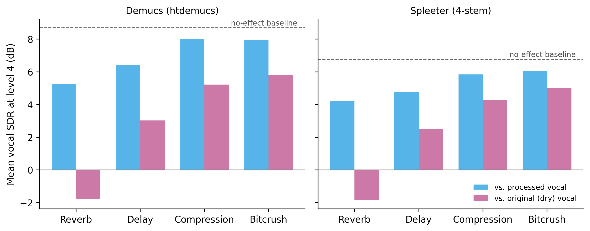
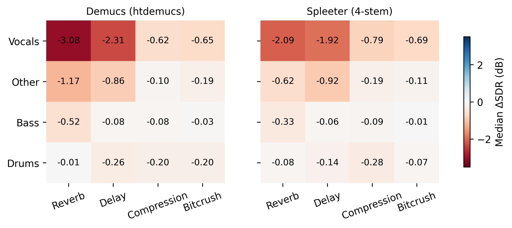

# Experiment 2 handoff: how vocal effects affect music source separation

*Prepared for the paper-writing co-author. Everything here was generated from the result files in `Experiment2Results_v2/`, so the numbers can be copied directly. Figures are in `results/exp2/figures/` (PNG and PDF) and the underlying tables are in `results/exp2/tables/` (CSV).*

## 1. One-paragraph summary

We asked how common vocal effects change the quality of music source separation. Using the 50 MUSDB18 test songs, we applied four effects (reverb, delay, compression, bitcrushing) at four strengths each to the **vocal stem only**, matched the processed vocal's loudness to the original vocal, remixed it with the untouched drums, bass and other stems, and separated the mixes with two models (Spleeter and Demucs). Reverb and delay degrade the vocal estimate in a graded way (median SDR loss up to about 3.1 dB for reverb and 2.3 dB for delay with Demucs). Compression and bitcrushing cost under about 0.8 dB once loudness is controlled. The accompaniment stems are barely affected. Both models behave alike, and both return the vocal *with* its effect rather than removing it.

## 2. Headline findings (safe to state)

1. **Reverb and delay are the harmful effects, and the damage grows with level.** Median vocal ΔSDR at level 4: reverb -3.08 dB (Demucs) / -2.09 dB (Spleeter); delay -2.31 / -1.92 dB.
2. **Compression and bitcrushing are minor when loudness is controlled** (median ΔSDR from -0.13 to -0.79 dB across all levels and both models).
3. **The effect is concentrated on the vocal stem.** Drums and bass barely change; `other` loses about 0.6 to 1.2 dB under strong reverb or delay (Section 7).
4. **Both models are similarly affected.** Demucs is about 2 dB better in absolute terms (baseline vocal SDR 8.7 vs 6.8 dB) but suffers slightly more from strong reverb and delay.
5. **The models keep the effect in the vocal stem.** Scoring against the original dry vocal is always worse than scoring against the processed vocal; for strong reverb the dry-reference SDR is negative (Section 7.3).
6. **All 32 (model × effect × level) vocal degradations are statistically significant** (one-sided paired Wilcoxon, Bonferroni over 32 tests, largest p = 5e-08). Statistical significance does not mean practical significance: bitcrushing's ~0.4 dB is detectable but small, so lead with effect sizes.

## 3. Data

- **Dataset:** MUSDB18 **test** subset, 50 tracks, 44.1 kHz stereo, 3.46 hours in total (track length 76 s to 430 s, median 247 s). Each track provides four stems: vocals, drums, bass, other.
- **Definition to get right in the text:** the "accompaniment" in MUSDB18 is drums + bass + other (everything except vocals). `other` is a catch-all (guitars, keys, synths, and more), not "piano" or "guitar" specifically.

## 4. How the test data were synthesized

For each song we built **17 conditions**: the unprocessed song ("no effect") plus 4 effects × 4 levels. That is 850 mixes per model. Only the **vocal stem** is processed; drums, bass and other are never touched. The mix is drums + bass + other + processed vocal.

### 4.1 Effects and parameters

| Effect | What it does | L1 | L2 | L3 | L4 |
|---|---|---|---|---|---|
| Reverb | Convolution with a room impulse response, wet/dry mix; IR gain scales the tail | mix 0.15, IR gain 0.75 | 0.35, 1.0 | 0.60, 1.25 | 0.85, 1.5 |
| Delay | Feed-forward echoes: `repeats` copies delayed by 1×, 2×, ... × `delay_ms`, each attenuated by 8 dB, added to the dry vocal | 120 ms × 1 | 200 ms × 2 | 300 ms × 3 | 400 ms × 4 |
| Compression | Feed-forward compressor with attack/release envelope follower, hard knee, plus make-up gain | thr -25 dB, 1.4:1, 5/50 ms, +0 dB | -30 dB, 3:1, 10/100 ms, +2 dB | -35 dB, 8:1, 20/200 ms, +8 dB | -40 dB, 20:1, 40/400 ms, +12 dB |
| Bitcrushing | Bit-depth reduction plus sample-and-hold downsampling (factor 4, no anti-alias filter, so an effective 11.025 kHz rate) | 12-bit | 10-bit | 8-bit | 6-bit |

Implementation notes worth knowing (details for a methods section or a footnote):
- **Reverb:** the impulse response is `impulseresponse.wav` (mono, 96 kHz, 2 s). The code uses the 1.01 s to 1.30 s portion (about 0.29 s), scaled to unit energy, and convolves via FFT after resampling the vocal to 96 kHz and back. *To confirm: the source/citation of this IR and its approximate decay time, so the paper can describe the reverb physically.*
- **Delay:** implemented with `pydub` on 16-bit audio.
- **Compression:** the envelope follower runs over the interleaved stereo sample stream, so both channels share one envelope. This is a simplification of a true stereo-linked compressor, so describe it as "a simple compressor", not a specific hardware model.
- The effects are our own simple implementations, not commercial plugins. Say so.

### 4.2 Loudness matching (an important methodological control)

Effects change loudness, and separation scores depend on how loud the vocal is in the mix. In an early version of this experiment we did **not** control for this, and reverb level 4 made the vocal about 9 dB louder while compression level 4 made it about 6.5 dB quieter. That produced misleading results (for example compression looked 4 to 7 dB harmful, when the loudness-controlled loss is under 1 dB). So in the final version:

1. Each processed vocal is scaled by a single gain so that its **RMS equals the original vocal's RMS** (whole-track RMS, both channels).
2. If the resulting mix would exceed full scale (peak > 0.999), the **entire mix is attenuated by one common factor**, and the reference stems are scaled identically, so the vocal-to-accompaniment balance is unchanged. This happened in 343 of 850 conditions (up to 11.9 dB; some songs' stems sum to more than full scale even with no effect).
3. Every gain is logged in `Experiment2SynthesizedData_v2/loudness_log.csv`.

Applied RMS-matching gain (dB) by effect, across all songs and levels (negative means the effect had made the vocal louder, and we turned it down):

| effect | mean | min | max |
|---|---|---|---|
| reverb | -3.40 | -16.70 | 1.60 |
| delay | -1.40 | -2.80 | -0.30 |
| compression | 4.60 | -2.50 | 9.80 |
| bitcrush | -0.00 | -0.20 | 0.00 |

### 4.3 Reference stems

For each condition we saved the exact stems that are in the mix: raw drums, bass, other, and the **processed** vocal (same scaling as the mix). Scores are computed against these, so a model is never penalized for not removing the effect. (A separate analysis, Section 7.3, also scores against the original dry vocal.)

## 5. Models and settings

| | Spleeter | Demucs |
|---|---|---|
| Model | `spleeter:4stems` (v2.3.2), TensorFlow 2.13, Python 3.8 | `htdemucs` (Hybrid Transformer Demucs), Demucs 4.1.0a2, PyTorch 2.0.1 |
| Stems | vocals, drums, bass, other | vocals, drums, bass, other |
| Settings | default; **a new Separator for every file**, run on CPU | defaults: shifts=1, overlap=0.25, segment splitting on |
| Output | 16-bit WAV at 44.1 kHz | 16-bit WAV at 44.1 kHz |

Two practical notes:
- **Spleeter state bug (worth one sentence in the methods).** Reusing a single Spleeter object across files made each output depend on the previous file (the same mix scored 3.4 dB or 9.8 dB vocal SDR depending on what ran before it). We therefore create a fresh Separator for every file, and we verified the outputs. Earlier batch-run numbers that reused the object were discarded.
- **Demucs randomness.** Demucs's default `shifts=1` applies a random time shift, so separate runs differ slightly. We ran each file once.

Hardware: Apple M4 Max (128 GB); Demucs on the Apple GPU (`mps`), Spleeter on CPU.

## 6. Evaluation

- **Metric:** time-domain **SDR** over the full track, `SDR = 10·log10( Σ ref² / Σ (ref − est)² )`, computed per stem, per condition, per song. This is plain SDR, not the BSS-Eval version from `museval` (state this so readers do not assume otherwise). SI-SDR is also in the result CSV.
- **ΔSDR** = SDR in a given condition minus SDR for the same song, stem and model with no effect. Negative means the effect hurt. This removes song difficulty.
- **Aggregation:** median over 50 songs (robust to a few extreme songs), with 95% bootstrap confidence intervals (2,000 resamples of songs). Means are also in `tables/vocals_delta_sdr_summary.csv`.
- **Tests:** one-sided paired Wilcoxon signed-rank test that ΔSDR < 0, Bonferroni-corrected over 32 tests.
- No stems were excluded (no silent references in this set).

## 7. Results

### 7.1 Baseline (no effect), vocal and accompaniment stems, mean and median SDR (dB)

| stem | Demucs mean | Spleeter mean | Demucs median | Spleeter median |
|---|---|---|---|---|
| vocals | 8.69 | 6.76 | 9.23 | 6.90 |
| drums | 10.11 | 6.44 | 10.13 | 6.12 |
| bass | 8.95 | 4.71 | 8.65 | 4.61 |
| other | 6.29 | 4.46 | 6.70 | 4.96 |

Demucs is about 2 to 4 dB better than Spleeter on every stem. Spleeter's vocal baseline (about 6.8 dB) is close to the value published for Spleeter on this dataset (verify the exact published figure before citing it), which is a useful sanity check to mention.

### 7.2 Vocal ΔSDR by effect and level (Figure 1)

Median ΔSDR in dB [95% bootstrap CI], 50 songs:

| effect | level | Demucs | Spleeter |
|---|---|---|---|
| Reverb | 1 | -0.55 [-0.71, -0.44] | -0.36 [-0.42, -0.26] |
| Reverb | 2 | -2.13 [-2.53, -1.81] | -1.60 [-1.91, -1.32] |
| Reverb | 3 | -2.85 [-3.41, -2.30] | -2.11 [-2.61, -1.51] |
| Reverb | 4 | -3.08 [-3.65, -2.35] | -2.09 [-2.68, -1.46] |
| Delay | 1 | -0.52 [-0.59, -0.41] | -0.29 [-0.38, -0.24] |
| Delay | 2 | -1.20 [-1.47, -1.01] | -0.78 [-1.00, -0.70] |
| Delay | 3 | -1.79 [-2.01, -1.56] | -1.50 [-1.66, -1.27] |
| Delay | 4 | -2.31 [-2.63, -2.08] | -1.92 [-2.22, -1.79] |
| Compression | 1 | -0.13 [-0.18, -0.11] | -0.15 [-0.19, -0.12] |
| Compression | 2 | -0.45 [-0.56, -0.31] | -0.49 [-0.65, -0.40] |
| Compression | 3 | -0.56 [-0.86, -0.41] | -0.75 [-0.90, -0.61] |
| Compression | 4 | -0.62 [-0.81, -0.30] | -0.79 [-1.01, -0.63] |
| Bitcrush | 1 | -0.30 [-0.39, -0.25] | -0.48 [-0.58, -0.36] |
| Bitcrush | 2 | -0.33 [-0.39, -0.23] | -0.48 [-0.58, -0.37] |
| Bitcrush | 3 | -0.36 [-0.45, -0.24] | -0.49 [-0.60, -0.36] |
| Bitcrush | 4 | -0.65 [-0.76, -0.56] | -0.69 [-0.86, -0.55] |

Share of songs whose vocal SDR dropped by more than 1 dB (averaged over levels), %:

| effect | demucs | spleeter |
|---|---|---|
| bitcrush | 11 | 8 |
| compression | 16 | 19 |
| delay | 64 | 54 |
| reverb | 76 | 64 |


Observations: reverb and delay grow steadily with level; reverb roughly plateaus between levels 3 and 4; compression and bitcrushing stay small at all levels.

**Model comparison (paired, per song and condition).** Negative means Demucs was hurt more than Spleeter:

| effect | level | median (Demucs - Spleeter) dSDR | Wilcoxon p |
|---|---|---|---|
| Bitcrush | 1 | 0.21 | 0.008 |
| Bitcrush | 2 | 0.22 | 0.005 |
| Bitcrush | 3 | 0.18 | 0.008 |
| Bitcrush | 4 | 0.08 | 0.585 |
| Compression | 1 | 0.02 | 0.030 |
| Compression | 2 | 0.07 | 0.005 |
| Compression | 3 | 0.17 | 0.001 |
| Compression | 4 | 0.25 | <0.001 |
| Delay | 1 | -0.19 | <0.001 |
| Delay | 2 | -0.38 | <0.001 |
| Delay | 3 | -0.22 | <0.001 |
| Delay | 4 | -0.27 | 0.002 |
| Reverb | 1 | -0.14 | <0.001 |
| Reverb | 2 | -0.54 | <0.001 |
| Reverb | 3 | -0.80 | <0.001 |
| Reverb | 4 | -0.97 | <0.001 |

Demucs is hurt slightly more by strong reverb and by delay; Spleeter is hurt slightly more by bitcrushing and compression. The differences are about 0.2 to 1 dB, so the fair summary is "similar sensitivity, different absolute level."

### 7.3 Do the models keep or remove the effect? (Figure 3)

We also scored the vocal estimate against the **original dry vocal**. Mean vocal SDR (dB) at level 4:

| effect | Demucs vs processed | Demucs vs dry | Spleeter vs processed | Spleeter vs dry |
|---|---|---|---|---|
| No effect | 8.69 | 8.69 | 6.76 | 6.76 |
| Reverb | 5.25 | -1.80 | 4.24 | -1.85 |
| Delay | 6.42 | 3.03 | 4.78 | 2.49 |
| Compression | 7.99 | 5.21 | 5.84 | 4.26 |
| Bitcrush | 7.96 | 5.78 | 6.04 | 5.01 |

The dry-reference SDR is always lower, and for strong reverb it is **negative**: the estimate is further from the dry vocal than silence would be. The reverb tail is treated as part of the singer and stays in the vocal stem. Caveat: part of this gap is simply how different the dry and processed vocals are, so state it as "the models return the vocal as it sounds in the mix."



### 7.4 Other stems (Figure 2)

Median ΔSDR at level 4 (dB), all four stems:

| stem | effect | Demucs | Spleeter |
|---|---|---|---|
| vocals | reverb | -3.08 | -2.09 |
| vocals | delay | -2.31 | -1.92 |
| vocals | compression | -0.62 | -0.79 |
| vocals | bitcrush | -0.65 | -0.69 |
| other | reverb | -1.17 | -0.62 |
| other | delay | -0.86 | -0.92 |
| other | compression | -0.10 | -0.19 |
| other | bitcrush | -0.19 | -0.11 |
| bass | reverb | -0.52 | -0.33 |
| bass | delay | -0.08 | -0.06 |
| bass | compression | -0.08 | -0.09 |
| bass | bitcrush | -0.03 | -0.01 |
| drums | reverb | -0.01 | -0.08 |
| drums | delay | -0.26 | -0.14 |
| drums | compression | -0.20 | -0.28 |
| drums | bitcrush | -0.20 | -0.07 |



The accompaniment is largely unaffected, with a modest loss on `other` (0.6 to 1.2 dB) under strong reverb or delay. This is a measurable version of the audible observation that some of the effect ends up in the wrong stem. `tables/all_stems_median_dSDR_pooled_levels.csv` has the same table pooled across levels.

### 7.5 Extreme cases (mention as outliers, not as typical)

A few songs drop much more than the median. The 8 largest drops (ΔSDR in dB):

| model | song | condition | stem | delta_sdr |
|---|---|---|---|---|
| Demucs | PR - Happy Daze | delay_l1 | drums | -13.30 |
| Demucs | Little Chicago's Finest - My Own | reverb_l4 | bass | -12.50 |
| Demucs | Little Chicago's Finest - My Own | reverb_l2 | bass | -12.40 |
| Demucs | Little Chicago's Finest - My Own | reverb_l3 | bass | -12.00 |
| Demucs | Side Effects Project - Sing With Me | reverb_l4 | vocals | -11.80 |
| Demucs | Side Effects Project - Sing With Me | reverb_l3 | vocals | -11.80 |
| Demucs | Side Effects Project - Sing With Me | reverb_l3 | other | -11.80 |
| Demucs | PR - Happy Daze | reverb_l3 | drums | -11.70 |

Some of these are likely genuine leakage (strong reverb pushing vocal energy into the bass or `other` estimate). We have not investigated each one, so describe them as outliers, not as an established mechanism. This is why we report medians alongside means.

## 8. What we can and cannot claim

**Can claim:** reverb and delay measurably degrade the vocal estimate for both models, in a graded way, in a loudness-controlled test on 50 songs; compression and bitcrushing have small effects; the accompaniment stems are mostly unaffected; the models do not remove the effect.

**Do not claim (not tested):**
- Anything about real-world commercial recordings or plugin-processed vocals (our effects are simple synthetic implementations).
- Perceptual quality (SDR is an objective metric; no listening test).
- Which model is "better" in general (Demucs is better in absolute SDR; sensitivity to effects is similar).
- Why reverb hurts (we describe the effect, not the mechanism).
- Generalization beyond MUSDB18 test or beyond these two models (both are older; newer models such as BS-RoFormer were not tested).

## 9. Corrections to the earlier (Experiment 1 and old Experiment 2) write-up

- **"Accompaniment ≈ piano"** is incorrect; accompaniment = drums + bass + other (Section 3).
- **The older Experiment 2 numbers** (for example reverb level 4 near -20 dB SI-SDR, and "compression is moderate") came from a version where effect loudness was not controlled. Use the numbers in this document instead.
- Experiment 1 was rechecked: recomputing its scores from the saved outputs reproduces all 24 numbers in the write-up **exactly**, provided they are described as **medians over the 50 songs** on mono downmixes (the write-up does not say "median"; it should). A spot check of 20 Spleeter outputs (5 songs × 4 pairings) also matched a clean re-run.

## 9b. Experiment 1 in brief (for the write-up)

- **Design:** the vocal stem is added to one non-vocal stem (bass, drums, other, or accompaniment = drums + bass + other) for each of the 50 songs; both models (2-stem mode) separate the vocal; the estimate is scored against the true vocal stem.
- **Metrics** (mono downmix, true vocal as reference): SI-SDR; an "SI-SAR-like" artifact ratio, `10 log10(||est||² / ||est − proj(est onto vocal)||²)`, which is a fast approximation and not BSS-Eval SAR; and RMSE, which depends on level. Report the aggregation as the **median over 50 songs**.
- **Result (median vocal SI-SDR, dB):** bass 20.9 (Demucs) / 15.0 (Spleeter); drums 15.6 / 11.8; other 9.8 / 7.9; accompaniment 8.8 / 6.5. Demucs is better on every pairing; both are best with bass and drums and worst with other and accompaniment. The harmonic-overlap explanation is a hypothesis, not a tested finding.
- **Where these numbers come from:** the write-up table is the `Source = vocals` rows of the ground-truth evaluation in the project repository (`archive/Evaluation/Evaluation Results/Median Scores/exp1_summary_All_Results.csv`, from `evaluation_exp1_results_to_gt.xlsx`). We re-derived every value from the saved separated outputs and they match (SI-SDR and SI-SAR-like to within 0.001 dB, RMSE within 0.00002). "Bass", "Drums", "Other" and "Accompaniment" in the write-up name the *pairing*; the score is for the recovered **vocal**. The same file also has a second set of rows scoring the separated non-vocal remainder against the true stem; the write-up does not use them.
- **Do not confuse with** the `demucs_vs_spleeter_*.xlsx` files: those compare Spleeter with Demucs's output (model agreement, not accuracy) and are not the source of any table here.
- Full table and figure: `experiments/exp1_interference/` and `results/exp1/`; code in `src/` (`make_pairs_exp1.py`, `run_spleeter_exp1.py`, `run_demucs_exp1.sh`, `evaluate_exp1.py`).

## 10. Suggested figures and tables for the paper

- **Figure 1** (`fig1_vocal_delta_sdr_by_level`): main result, both models.
- **Figure 2** or **Table** for stems at level 4 (`fig2_stems_by_effect_level4`): leakage into other stems.
- **Figure 3** (`fig3_processed_vs_dry_reference_level4`): models keep the effect.
- **Table 1:** effect parameters (Section 4.1). **Table 2:** vocal ΔSDR with confidence intervals (Section 7.2).

## 11. Reproducing the results

See the repository README for setup. In short (three separate environments, see `requirements/`):

```
python src/make_data_exp2.py --workers 8     # data-and-evaluation env: mixes, reference stems, loudness log
python src/run_demucs_exp2.py                            # demucs env
python src/run_spleeter_exp2.py --workers 3              # spleeter env (CPU, fresh Separator per file)
python src/evaluate_exp2.py --workers 6 --dry-reference  # data-and-evaluation env: results/exp2/metrics.csv
python src/make_figures_exp2.py                          # figures and tables in results/exp2/
```

Software used: Python 3.10 (`musdb` 0.4.3, `pydub` 0.25.1, `torch` 2.5.1, `numpy` 2.2.5), Python 3.8 (Spleeter 2.3.2, TensorFlow 2.13.0), Python 3.11 (Demucs 4.1.0a2, torch 2.0.1).

## 12. Items still to confirm before writing

1. Source and approximate decay time of `impulseresponse.wav` (for describing the reverb).
2. Whether the metric in the paper is plain SDR (as here) or SI-SDR (also available).
3. Citations: verify every reference (titles, venues, years) before submission.
4. Data release: MUSDB18's license may restrict redistributing audio. Releasing the code and loudness log is safe; check before sharing audio.
